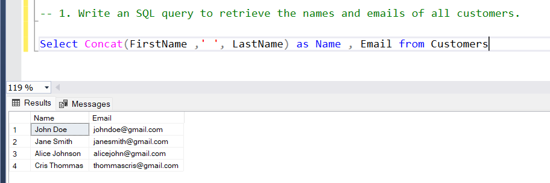
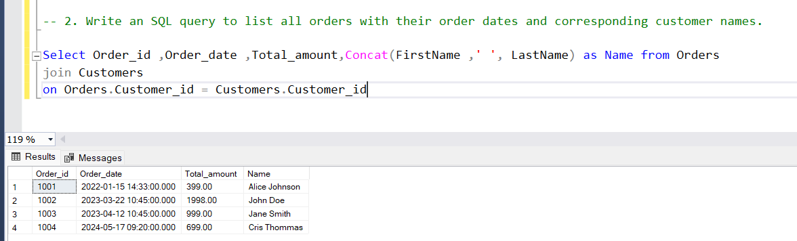
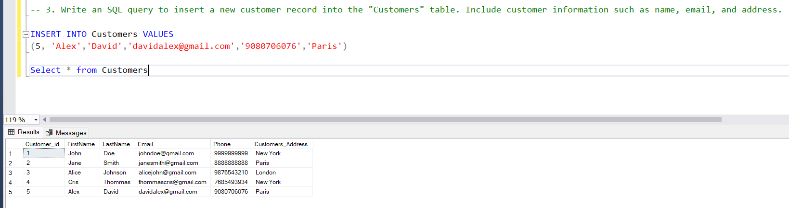
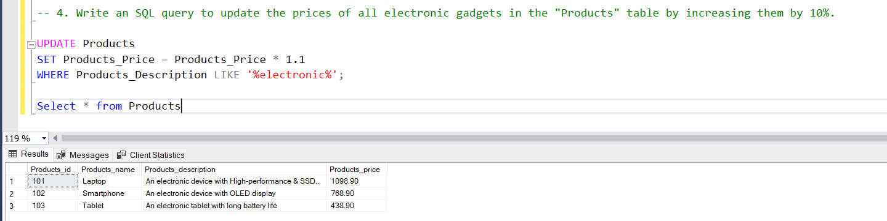
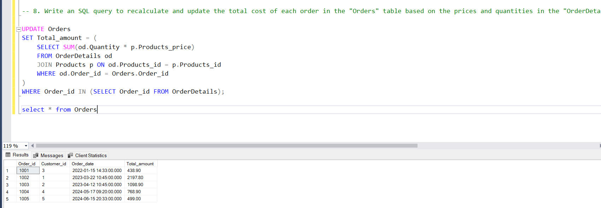
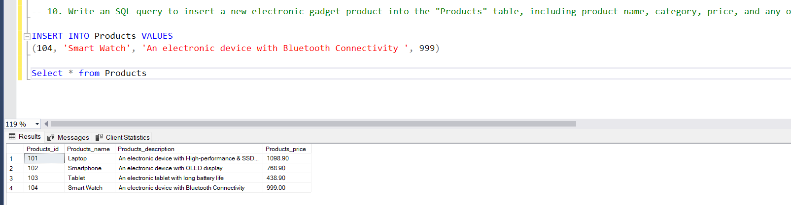
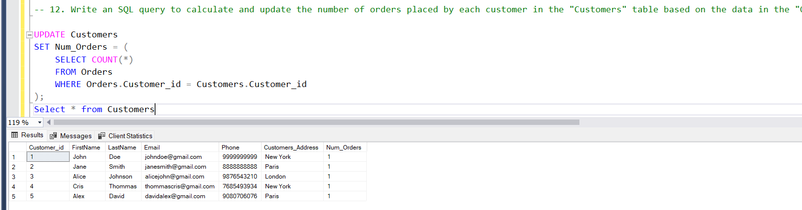
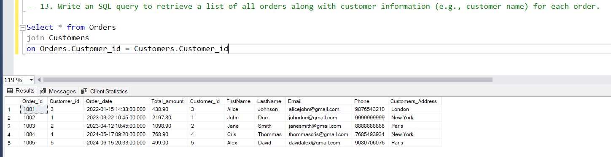
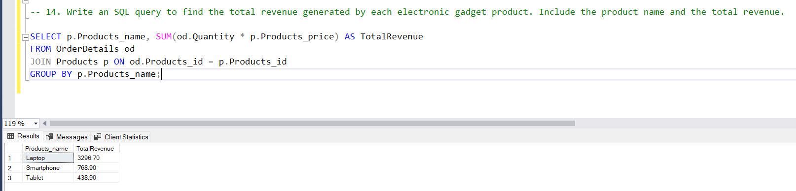
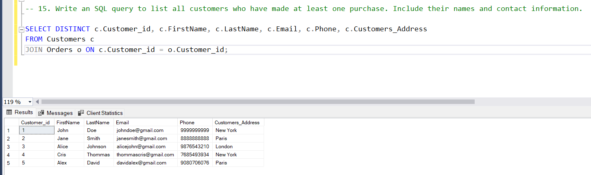

```sql
CREATE TABLE Customers(
    Customer_id INT PRIMARY KEY,
    FirstName VARCHAR(255),
	LastName VARCHAR(255),
	Email VARCHAR(255),
	Phone VARCHAR(255),
    Customers_Address VARCHAR(255),
	Num_Orders INT
);


INSERT INTO Customers(Customer_id,FirstName,LastName,Email ,Phone ,Customers_Address,Num_Orders) VALUES
(1,	'John','Doe','johndoe@gmail.com','9999999999','New York',0),
(2,'Jane','Smith','janesmith@gmail.com','8888888888','Paris',0),
(3,'Alice','Johnson','alicejohn@gmail.com','9876543210','London',0),
(4,'Cris','Thommas','thommascris@gmail.com','7685493934','New York',0)


Select * from Customers

-----------------------------------------------------------------------------------------


CREATE TABLE Products(
    Products_id INT PRIMARY KEY,
    Products_name VARCHAR(255),
    Products_description VARCHAR(255),
	Products_price decimal(10,2),
);


INSERT INTO Products (Products_id,Products_name,Products_description,Products_price) VALUES
(101, 'Laptop', 'An electronic device with High-performance & SSD storage', 999),
(102, 'Smartphone', 'An electronic device with OLED display', 699),
(103, 'Tablet', 'An electronic tablet with long battery life', 399);


Select * from Products


--------------------------------------------------------------------------------------------------------


CREATE TABLE Orders(
    Order_id INT PRIMARY KEY,
	Customer_id INT,
    Order_date DateTime,
    Total_amount Decimal(10,2),
	FOREIGN KEY (Customer_id) REFERENCES Customers(Customer_id),
);


INSERT INTO Orders (Order_id,Customer_id,Order_date,Total_amount) VALUES
(1001,3,'2022-01-15 14:33:00',399),
(1002,1,'2023-03-22 10:45:00',1998),
(1003,2,'2023-04-12 10:45:00',999),
(1004,4,'2024-05-17 09:20:00',699)


Select * from Orders

-------------------------------------------------------------------------------------


CREATE TABLE OrderDetails(
    OrderDetail_id INT PRIMARY KEY,
	Order_id INT,
	Products_id INT,
    Quantity INT ,
	FOREIGN KEY (Order_id) REFERENCES Orders(Order_id),
	FOREIGN KEY (Products_id) REFERENCES Products(Products_id),
);

INSERT INTO OrderDetails (OrderDetail_id,Order_id,Products_id,Quantity) VALUES
(2001,1001,103,1),
(2002,1002,101,2),
(2003,1003,101,1),
(2004,1004,102,1)


Select * from OrderDetails

---------------------------------------------------------------------------------------


CREATE TABLE Inventory(
    Inventory_id INT PRIMARY KEY,
	Products_id INT,
    QuantityInStock INT,
    LastStockUpdate TIMESTAMP,
	FOREIGN KEY (Products_id) REFERENCES Products(Products_id),
);

INSERT INTO Inventory (Inventory_id, Products_id, QuantityInStock, LastStockUpdate)
VALUES
    (1, 101, 10, DEFAULT),
    (2, 102, 15, DEFAULT),
    (3, 103, 20, DEFAULT);

Select * from Inventory

```

**Questions:**

1. Write an SQL query to retrieve the names and emails of all customers.

```sql

```



2. Write an SQL query to list all orders with their order dates and corresponding customer names.



3. Write an SQL query to insert a new customer record into the "Customers" table. Include customer information such as name, email, and address.



4. Write an SQL query to update the prices of all electronic gadgets in the "Products" table by increasing them by 10%.



5. Write an SQL query to delete a specific order and its associated order details from the "Orders" and "OrderDetails" tables. Allow users to input the order ID as a parameter.
6. Write an SQL query to insert a new order into the "Orders" table. Include the customer ID, order date, and any other necessary information.


7. Write an SQL query to update the contact information (e.g., email and address) of a specific customer in the "Customers" table. Allow users to input the customer ID and new contact information.
8. Write an SQL query to recalculate and update the total cost of each order in the "Orders" table based on the prices and quantities in the "OrderDetails" table.



9. Write an SQL query to delete all orders and their associated order details for a specific customer from the "Orders" and "OrderDetails" tables. Allow users to input the customer ID as a parameter.
10. Write an SQL query to insert a new electronic gadget product into the "Products" table, including product name, category, price, and any other relevant details.



11. Write an SQL query to update the status of a specific order in the "Orders" table (e.g., from "Pending" to "Shipped"). Allow users to input the order ID and the new status.
12. Write an SQL query to calculate and update the number of orders placed by each customer in the "Customers" table based on the data in the "Orders" table.



13. Write an SQL query to retrieve a list of all orders along with customer information (e.g., customer name) for each order.



14. Write an SQL query to find the total revenue generated by each electronic gadget product. Include the product name and the total revenue.



15. Write an SQL query to list all customers who have made at least one purchase. Include their names and contact information.



Please make sure to create your own data for these tables to test your queries effectively.
