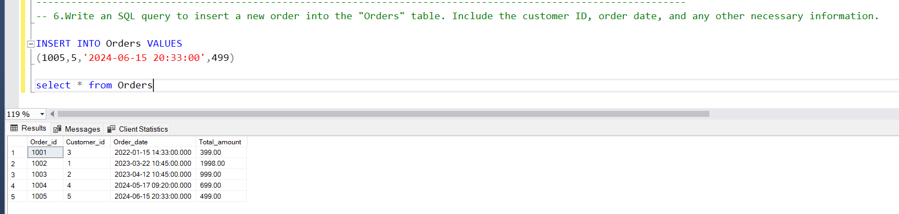

## Tables

```sql
CREATE TABLE Customers(
    Customer_id INT PRIMARY KEY,
    FirstName VARCHAR(255),
	LastName VARCHAR(255),
	Email VARCHAR(255),
	Phone VARCHAR(255),
    Customers_Address VARCHAR(255),
	Num_Orders INT
);


INSERT INTO Customers(Customer_id,FirstName,LastName,Email ,Phone ,Customers_Address,Num_Orders) VALUES
(1,	'John','Doe','johndoe@gmail.com','9999999999','New York',0),
(2,'Jane','Smith','janesmith@gmail.com','8888888888','Paris',0),
(3,'Alice','Johnson','alicejohn@gmail.com','9876543210','London',0),
(4,'Cris','Thommas','thommascris@gmail.com','7685493934','New York',0)


Select * from Customers

-----------------------------------------------------------------------------------------


CREATE TABLE Products(
    Products_id INT PRIMARY KEY,
    Products_name VARCHAR(255),
    Products_description VARCHAR(255),
	Products_price decimal(10,2),
);


INSERT INTO Products (Products_id,Products_name,Products_description,Products_price) VALUES
(101, 'Laptop', 'An electronic device with High-performance & SSD storage', 999),
(102, 'Smartphone', 'An electronic device with OLED display', 699),
(103, 'Tablet', 'An electronic tablet with long battery life', 399);


Select * from Products


--------------------------------------------------------------------------------------------------------


CREATE TABLE Orders(
    Order_id INT PRIMARY KEY,
	Customer_id INT,
    Order_date DateTime,
	Status VARCHAR (255),
    Total_amount Decimal(10,2),
	FOREIGN KEY (Customer_id) REFERENCES Customers(Customer_id),
);


INSERT INTO Orders (Order_id,Customer_id,Order_date,Status,Total_amount) VALUES
(1001,3,'2022-01-15 14:33:00','Pending',399),
(1002,1,'2023-03-22 10:45:00','Shipped',1998),
(1003,2,'2023-04-12 10:45:00','Pending',999),
(1004,4,'2024-05-17 09:20:00','Shipped',699)


Select * from Orders

-------------------------------------------------------------------------------------


CREATE TABLE OrderDetails(
    OrderDetail_id INT PRIMARY KEY,
	Order_id INT,
	Products_id INT,
    Quantity INT ,
	FOREIGN KEY (Order_id) REFERENCES Orders(Order_id),
	FOREIGN KEY (Products_id) REFERENCES Products(Products_id),
);

INSERT INTO OrderDetails (OrderDetail_id,Order_id,Products_id,Quantity) VALUES
(2001,1001,103,1),
(2002,1002,101,2),
(2003,1003,101,1),
(2004,1004,102,1)


Select * from OrderDetails

---------------------------------------------------------------------------------------

CREATE TABLE Inventory(
    Inventory_id INT PRIMARY KEY,
	Products_id INT,
    QuantityInStock INT,
    LastStockUpdate TIMESTAMP,
	FOREIGN KEY (Products_id) REFERENCES Products(Products_id),
);

INSERT INTO Inventory (Inventory_id, Products_id, QuantityInStock, LastStockUpdate)
VALUES
    (1, 101, 10, DEFAULT),
    (2, 102, 15, DEFAULT),
    (3, 103, 20, DEFAULT);

Select * from Inventory
-----------------------------------------------------------------------------------------
```

**Questions:**

1. Write an SQL query to retrieve the names and emails of all customers.

```sql
Select Concat(FirstName ,' ', LastName) as Name , Email from Customers
```


2. Write an SQL query to list all orders with their order dates and corresponding customer names.

```sql
Select Order_id ,Order_date ,Total_amount,Concat(FirstName ,' ', LastName) as Name from Orders
join Customers
on Orders.Customer_id = Customers.Customer_id
```


3. Write an SQL query to insert a new customer record into the "Customers" table. Include customer information such as name, email, and address.

```sql
INSERT INTO Customers VALUES
(5,	'Alex','David','davidalex@gmail.com','9080706076','Paris',0)

Select * from Customers
```


4. Write an SQL query to update the prices of all electronic gadgets in the "Products" table by increasing them by 10%.

```sql
UPDATE Products
SET Products_Price = Products_Price * 1.1
WHERE Products_Description LIKE '%electronic%';

Select * from Products
```


5. Write an SQL query to delete a specific order and its associated order details from the "Orders" and "OrderDetails" tables. Allow users to input the order ID as a parameter.

```sql
DECLARE @Orderid_delete INT;
SET @Orderid_delete = 1004;

Delete from Orders
where Order_id = @Orderid_delete
Delete from OrderDetails
where Order_id = @Orderid_delete

Select * from Orders
Select * from OrderDetails
```


6. Write an SQL query to insert a new order into the "Orders" table. Include the customer ID, order date, and any other necessary information.

```sql
INSERT INTO Orders VALUES
(1005,5,'2024-06-15 20:33:00',499)

select * from Orders
```



7. Write an SQL query to update the contact information (e.g., email and address) of a specific customer in the "Customers" table. Allow users to input the customer ID and new contact information.

```sql
DECLARE @cust_id INT;
DECLARE @new_email VARCHAR(255);
DECLARE @new_Address VARCHAR(255);

SET @cust_id = 4;
SET @new_email ='cristhommas@gmail.com';
SET @new_Address = 'Germany';

Update Customers
SET Customers_Address = @new_Address,
     Email = @new_email
where Customer_id = @cust_id

Select * from Customers
```


8. Write an SQL query to recalculate and update the total cost of each order in the "Orders" table based on the prices and quantities in the "OrderDetails" table.

```sql
UPDATE Orders
SET Total_amount = (
    SELECT SUM(od.Quantity * p.Products_price)
    FROM OrderDetails od
    JOIN Products p ON od.Products_id = p.Products_id
    WHERE od.Order_id = Orders.Order_id
)
WHERE Order_id IN (SELECT Order_id FROM OrderDetails);

select * from Orders
```


9. Write an SQL query to delete all orders and their associated order details for a specific customer from the "Orders" and "OrderDetails" tables. Allow users to input the customer ID as a parameter.

```sql
DECLARE @Custid_del INT;
SET @Custid_del = 2;

Delete from Orders
where Customer_id = @Custid_del ;
Delete from OrderDetails
where Order_id IN ( SELECT Order_id from Orders Where Customer_id = @Custid_del)

Select * from Orders
Select * from OrderDetails
```


10. Write an SQL query to insert a new electronic gadget product into the "Products" table, including product name, category, price, and any other relevant details.

```sql
INSERT INTO Products VALUES
(104, 'Smart Watch', 'An electronic device with Bluetooth Connectivity ', 999)

Select * from Products
```


11. Write an SQL query to update the status of a specific order in the "Orders" table (e.g., from "Pending" to "Shipped"). Allow users to input the order ID and the new status.

```sql
Declare @Order_id_update INT ;
SET @Order_id_update =1001;

UPDATE Orders
SET Status = 'Shipped'
Where Order_id = @Order_id_update;

Select * from Orders
```


12. Write an SQL query to calculate and update the number of orders placed by each customer in the "Customers" table based on the data in the "Orders" table.

```sql
UPDATE Customers
SET Num_Orders = (
    SELECT COUNT(*)
    FROM Orders
    WHERE Orders.Customer_id = Customers.Customer_id
);
Select * from Customers
```


13. Write an SQL query to retrieve a list of all orders along with customer information (e.g., customer name) for each order.

```sql
Select * from Orders
join Customers
on Orders.Customer_id = Customers.Customer_id
```


14. Write an SQL query to find the total revenue generated by each electronic gadget product. Include the product name and the total revenue.

```sql
SELECT p.Products_name, SUM(od.Quantity * p.Products_price) AS TotalRevenue
FROM OrderDetails od
JOIN Products p ON od.Products_id = p.Products_id
GROUP BY p.Products_name;
```


15. Write an SQL query to list all customers who have made at least one purchase. Include their names and contact information.

```sql
SELECT DISTINCT c.Customer_id, c.FirstName, c.LastName, c.Email, c.Phone, c.Customers_Address
FROM Customers c
JOIN Orders o ON c.Customer_id = o.Customer_id;
```


